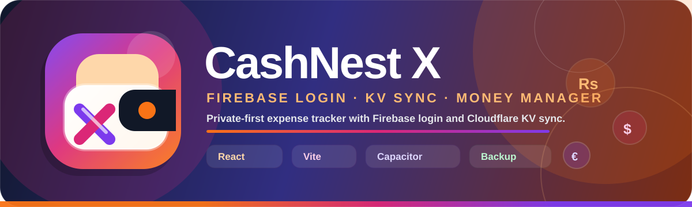

<p align="center">
  
</p>

<p align="center">
  <a href="https://github.com/tharindu899/CashNest_X/releases/latest"></a>
  
  
  
  
</p>

# 🧑‍💻 Developer Guide

> Architecture, safe edit rules, service boundaries, and release workflow.

---
## 🧠 Architecture

```text
src/
├── components/   reusable UI pieces
├── config/       app/env config
├── features/     optional feature modules
├── hooks/        ledger state + business logic
├── modals/       bottom sheet/modal UI
├── models/       default state and option lists
├── pages/        Home, Records, Analytics, Settings
├── services/     Firebase auth + Cloudflare backup services
└── utils/        pure helpers, exports, backup, formatting
```

## ✅ Current service rules

| Service | File | Rule |
| --- | --- | --- |
| 🔥 Firebase Google login | `src/services/googleAuth.js` | Login identity only. |
| ☁️ Cloudflare KV backup | `src/services/cloudBackup.js` | Encrypted backup upload/restore only. |
| 💾 Local backup | `src/utils/localBackup.js` | Offline backup/export. |

## 🧹 Removed providers

Do not add these back unless the project changes again:

- Legacy database backup/login.
- Old backup-provider code.
- Cloudflare R2 backup.

## 🧩 File separation rule

Keep features separated:

- Functions in `utils/`.
- Services in `services/`.
- Pages in `pages/`.
- Modals in `modals/`.
- Models/default data in `models/`.
- Native plugin code generated by workflow, not pasted into React files.

## 🔁 Backup flow in code

```text
Settings button → useLedger action → googleAuth Firebase token → cloudBackup Worker request → Worker verifies token → KV put/get
```

## 🧪 Before every ZIP/release

```bash
npm run check:worker
npm run release:check
npm run build
```

## 📦 Commit message style

Use semicolon-separated release notes:

```bash
./push.sh "add firebase setup guide; fix cloud backup wording; update project structure"
```

---

## 📖 Book navigation

| ⬅️ Previous | 🏠 Index | Next ➡️ |
| --- | --- | --- |
| [🔒 Private Updater](PRIVATE_REPO_UPDATER.md) | [📚 Documentation Home](README.md) | [✨ Features](FEATURES.md) |

⬆️ Back to top • 🪺 CashNest X docs rotate like a book.
